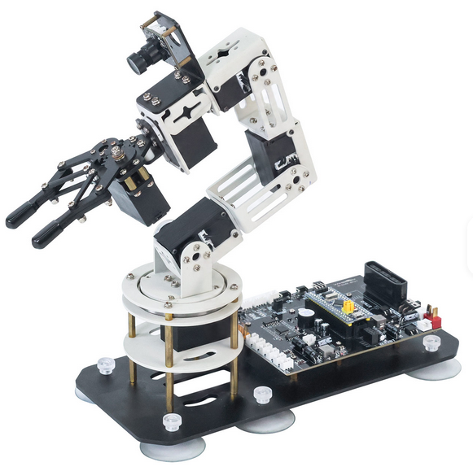
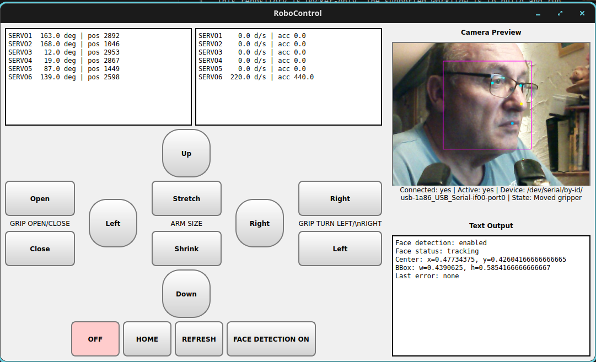

# Yahboom DOFBot Arm



This repository is Docker-only. The supported workflow is to build and run the ROS 2 Jazzy stack inside Docker and launch the Qt GUI from the container.

## What’s kept

- `docker/` - Dockerfile, compose file, and container entrypoint
- `src/` - ROS 2 packages for the arm bridge and MediaPipe detectors
- `third_party/Arm_Lib/` - vendor arm library copied into the image
- `RoboControl.py` - Qt entrypoint used inside the container
- `requirements-jazzy.txt` - Python dependencies for the image build
- `start_robocontrol_container_gui.sh` - Docker-only launcher for the GUI container
- `.env.example` - optional environment template for device paths and detector flags

## Build and run

```bash
ENABLE_LLM_CONTROLLER=1 ENABLE_SPEECH_CONTROLLER=1 DOFBOT_CONTROL_MODE=AUTO DOFBOT_STRICT_SAFETY=1 DOFBOT_LLM_PROVIDER=ollama DOFBOT_OLLAMA_MODEL=llama3.1:8b DOFBOT_AUDIO_DEVICE=/dev/snd DOFBOT_SPEECH_DEVICE=HD-3000 DOFBOT_VOICE_OUTPUT_ENABLED=1 DOFBOT_VOICE_OUTPUT_VOICE=en-us ./start_robocontrol_container_gui.sh
```

That command rebuilds the image, starts the ROS stack in the container, and opens the GUI on the host display through X11.

## License

This project is licensed under the Apache License 2.0. See [LICENSE](LICENSE).

## Container stack only

If you want the ROS stack without the GUI, use:

```bash
docker compose -f docker/docker-compose.yml up -d --build
```

## LLM and speech control

The stack includes an optional LLM controller node (`llm_controller.py`), a speech input node, and bridge-side command arbitration.

Create a runtime config file from the template:

```bash
cp config/llm_controller.example.json config/llm_controller.json
```

For LLM-assisted arm control with speech input, start the container with:

```bash
ENABLE_LLM_CONTROLLER=1 \
ENABLE_SPEECH_CONTROLLER=1 \
DOFBOT_CONTROL_MODE=AUTO \
DOFBOT_STRICT_SAFETY=1 \
DOFBOT_LLM_PROVIDER=ollama \
DOFBOT_OLLAMA_MODEL=llama3.1:8b \
DOFBOT_AUDIO_DEVICE=/dev/snd \
DOFBOT_SPEECH_DEVICE=HD-3000 \
DOFBOT_VOICE_OUTPUT_ENABLED=1 \
DOFBOT_VOICE_OUTPUT_VOICE=en-us \
./start_robocontrol_container_gui.sh
```

Recommended runtime settings and related options:

```bash
DOFBOT_COMMAND_RATE_LIMIT_HZ=8.0
DOFBOT_LLM_STALE_TIMEOUT_S=2.0
DOFBOT_MANUAL_OVERRIDE_WINDOW_S=1.5
DOFBOT_LLM_CONFIG_PATH=/opt/ros/overlay_ws/config/llm_controller.json
DOFBOT_LLM_PROVIDER=ollama
DOFBOT_OLLAMA_BASE_URL=http://127.0.0.1:11434
DOFBOT_OLLAMA_MODEL=llama3.1:8b
DOFBOT_LLM_API_TOKEN=      # optional, only needed for protected HTTP/LLM endpoints
DOFBOT_LLM_REQUEST_TIMEOUT_S=20.0
DOFBOT_LLM_REQUEST_RETRIES=3
DOFBOT_LLM_RETRY_BACKOFF_S=1.0
DOFBOT_LLM_FALLBACK_ON_ERROR=1
DOFBOT_VOICE_OUTPUT_ENABLED=1
DOFBOT_VOICE_OUTPUT_VOICE=       # optional espeak voice, e.g. en-us
DOFBOT_VOSK_MODEL_DIR=/opt/ros/overlay_ws/models/vosk-model-small-de-zamia-0.3
DOFBOT_AUDIO_DEVICE=/dev/snd
DOFBOT_SPEECH_DEVICE=HD-3000
DOFBOT_SPEECH_SAMPLE_RATE=16000
DOFBOT_SPEECH_BLOCKSIZE=2000
DOFBOT_SPEECH_LANGUAGE=de
DOFBOT_SPEECH_TOPIC=roboarm/speech_input
DOFBOT_SPEECH_FLUSH_SILENCE_S=0.8
```

The controller supports these providers:

- `ollama` for local models through Ollama
- `http` for a generic JSON endpoint, bearer token optional
- `heuristic` for no LLM call

For local Ollama tests, start with one of these models:

- `llama3.1:8b`
- `gemma3:12b`
- `qwen3.5:9b`

VOSK provides the offline speech recognizer used by the container. See [VOSK](https://alphacephei.com/vosk/) for model downloads and background information. This setup defaults to `models/vosk-model-small-de-zamia-0.3` for German speech control. The launcher mounts `/dev/snd` automatically when it exists on the host, so the microphone stream can be captured inside the container. The recognized transcript is published to `roboarm/speech_input` and consumed by the LLM controller as prompt input.

Quick microphone sanity check (prints recognized speech directly in terminal):

```bash
python3 src/arm_mediapipe/scripts/vosk_terminal_test.py --show-partials
```

List capture devices first if needed:

```bash
python3 src/arm_mediapipe/scripts/vosk_terminal_test.py --list-devices
```

If no speech is detected, set `DOFBOT_SPEECH_DEVICE` to a capture-device name substring, for example `HD-3000`, `USB Audio`, or a PortAudio input index.

Speech activation works as a persistent command mode:

- Say `Hallo` to activate speech command mode.
- After activation, the arm accepts speech commands without repeating the wake word.
- Say `Stop` to leave speech command mode again.

Supported speech commands include:

- German: `hoch`, `runter`, `links`, `rechts`, `home`, `nimm`, `release`, `aus`, `an`, `stop`
- English: `up`, `down`, `left`, `right`, `home`, `grip`, `release`, `power on`, `power off`, `stop`
- Rotation: `rotate grip left`, `rotate grip right`

Voice output is optional and offline via `espeak-ng`. When `DOFBOT_VOICE_OUTPUT_ENABLED=1`, the LLM controller announces executed actions on the system audio output.

Mode behavior:

- `GUI`: panel commands are accepted; LLM commands are rejected.
- `LLM`: LLM commands are accepted; panel commands are limited to emergency actions (`power_off`, `home`, `refresh`).
- `AUTO`: both sources are allowed, and recent manual input suppresses LLM commands for a short window.

The GUI has a `MODE` button to cycle through `GUI`, `LLM`, and `AUTO` at runtime.

## Arm Control



## Product Links (DOFBOT SE 6DOF)

- Official product page: https://category.yahboom.net/products/dofbot-se
- Official tutorial page: http://www.yahboom.net/study/DOFBOT_SE
- Yahboom store search: https://category.yahboom.net/search?q=DOFBOT+SE
- AliExpress search: https://de.aliexpress.com/w/wholesale-Yahboom-DOFBOT-SE-6DOF.html


## Notes

- The arm serial device is usually available under `/dev/serial/by-id/...`.
- The camera is published from `/mediapipe/camera/image/compressed`.
- Face detection and pose nodes are controlled through the environment flags in `.env` or the launcher command.
