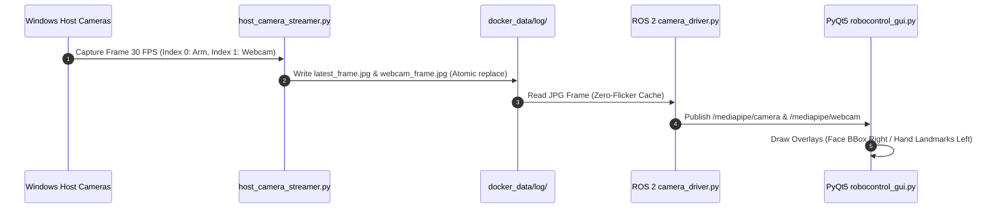
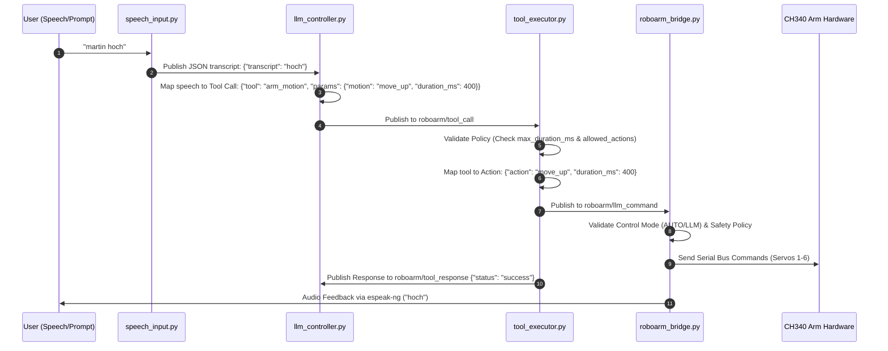
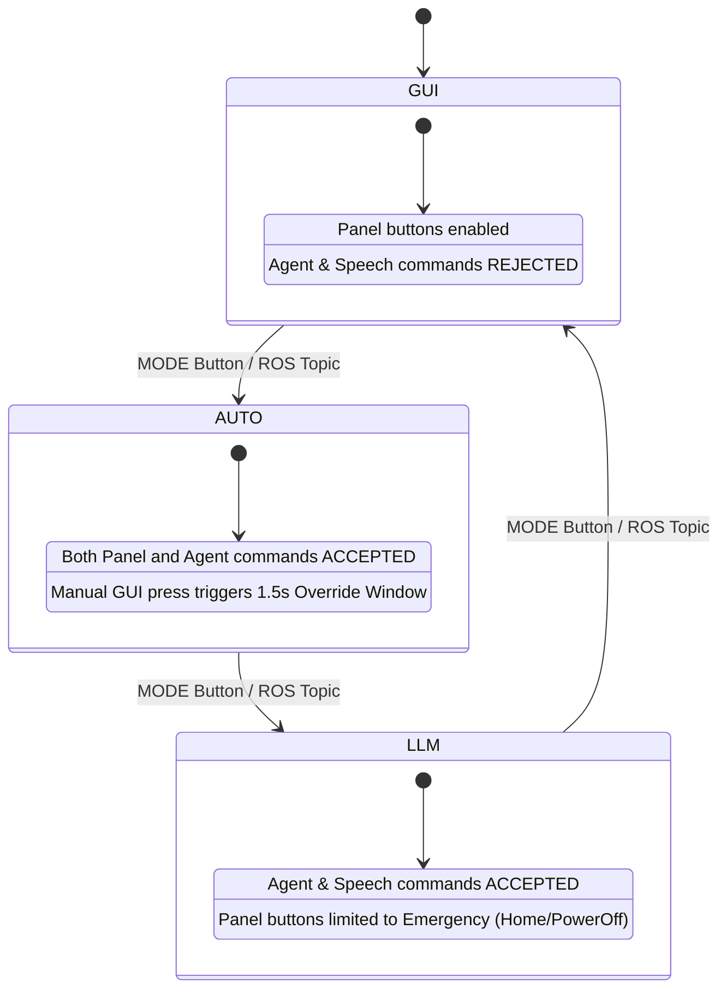

# Yahboom DOFBot Arm - System Architecture & Agent Control

This document provides a comprehensive technical overview of the system architecture, containerization layer, video/audio streaming pipelines, MediaPipe detection flows, and the **Agent Tool Control & LLM framework** powering the Yahboom DOFBOT SE 6DOF robotic arm.

---

## 🏗️ High-Level System Architecture

The project runs entirely in a **Docker / Podman container** on **ROS 2 Jazzy**, optimized for **Windows CPU execution** (no NVIDIA CUDA GPU required).

```mermaid
flowchart TB
    subgraph Host["Windows 11 Host"]
        subgraph Hardware["Physical Hardware"]
            SerialDev["CH340 USB-Serial (COM3)\nVID:1a86 PID:7523"]
            ArmCam["Arm USB Camera\n(Index 0)"]
            LaptopWebcam["Laptop PC Webcam\n(Index 1)"]
            LaptopMic["Integrated Microphone\n(Realtek / USB)"]
        end

        subgraph HostServices["Windows Background Services"]
            USBIPD["usbipd-win\n(Forwarding /dev/ttyUSB0)"]
            Streamer["host_camera_streamer.py\n(DirectShow Frame Capture)"]
            WSLg["WSLg Audio Server\n(/mnt/wslg/PulseServer)"]
            OllamaHost["Ollama Local LLM\n(qwen3.5:9b @ port 11434)"]
        end
    end

    subgraph Container["Linux Podman / Docker Container (ROS 2 Jazzy)"]
        subgraph DriverNodes["ROS 2 Drivers & Perception"]
            CamDriverArm["camera_driver.py (Arm)\n/mediapipe/camera/image/compressed"]
            CamDriverWeb["camera_driver.py (Webcam)\n/mediapipe/webcam/image/compressed"]
            FaceDetNode["07_FaceDetection.py\n/mediapipe/face_summary"]
            GestureDetNode["08_GestureDetection.py\n/mediapipe/gesture_summary"]
            SpeechNode["speech_input.py (Vosk)\nroboarm/speech_input"]
        end

        subgraph AgentFramework["Agent Tool & Control Framework"]
            LLMController["llm_controller.py\n(LLM Prompt & Grammar Parser)"]
            ToolExecutor["tool_executor.py\n(Agent Tool Validation)"]
            RoboArmBridge["roboarm_bridge.py\n(Serial Communication & Arbitration)"]
        end

        subgraph UserInterface["UI & Visualization"]
            PyQtGUI["robocontrol_gui.py\n(PyQt5 Dual-Preview Control Panel)"]
        end
    end

    %% Hardware Connections
    SerialDev -->|usbipd attach| USBIPD
    USBIPD -->|/dev/ttyUSB0| RoboArmBridge
    ArmCam -->|DirectShow 30 FPS| Streamer
    LaptopWebcam -->|DirectShow 30 FPS| Streamer
    LaptopMic -->|PulseAudio| WSLg

    %% File & Socket Mounts
    Streamer -->|latest_frame.jpg| CamDriverArm
    Streamer -->|webcam_frame.jpg| CamDriverWeb
    WSLg -->|/tmp/pulse-socket| SpeechNode

    %% ROS 2 Communications
    CamDriverArm -->|Arm Feed| FaceDetNode
    CamDriverArm -->|Arm Feed| PyQtGUI
    CamDriverWeb -->|Webcam Feed| GestureDetNode
    CamDriverWeb -->|Webcam Feed| PyQtGUI

    FaceDetNode -->|Face Bounding Box| PyQtGUI
    GestureDetNode -->|Hand Landmarks| PyQtGUI

    SpeechNode -->|Transcripts| LLMController
    LLMController -->|Tool Calls| ToolExecutor
    LLMController -->|Direct Action| RoboArmBridge
    LLMController -->|Ollama API| OllamaHost

    ToolExecutor -->|Validated Command| RoboArmBridge
    PyQtGUI -->|Manual Commands| RoboArmBridge
    PyQtGUI -->|Mode Setting (AUTO/LLM/GUI)| RoboArmBridge
```

---

## 📹 Video & Audio Pipeline Architecture

### 1. Dual Camera Streaming Pipeline (Zero-Latency DirectShow Bridge)

To circumvent USBIP isochronous bandwidth limitations in WSL2 Linux kernels, video frames are captured on the Windows host using OpenCV DirectShow and written atomically to a shared volume (`docker_data/log/`).



### 2. Audio & Microphone Pipeline (WSLg PulseAudio)

Audio is captured from the Windows default microphone and passed into the container via the **WSLg PulseAudio socket**:

- **Windows Host**: Audio source bound via WSLg `RDPSource`.
- **Podman Mount**: `-v /mnt/wslg/PulseServer:/tmp/pulse-socket:rw` with environment variables `PULSE_SERVER=unix:/tmp/pulse-socket` and `PULSE_SOURCE=RDPSource`.
- **Speech Input Node (`speech_input.py`)**: Consumes the 44.1 kHz PulseAudio stream, processes offline speech using **Vosk**, matches wake word (`martin` / `robby`), and publishes transcripts to `roboarm/speech_input`.

---

## 🤖 Agent Tool Control & LLM Architecture

The system features an autonomous **Agent Tool Control Framework** allowing local Large Language Models (Ollama) or speech commands to safely interact with the physical robotic arm through defined agent tools.

```mermaid
flowchart LR
    subgraph Inputs["Multi-Modal Inputs"]
        Voice["Mic Voice Input\n(e.g., 'martin nimm den becher')"]
        GUIInput["GUI Mode Switch / Buttons"]
    end

    subgraph SpeechVosk["Vosk Speech Engine"]
        VoskRec["Kaldi Grammar Recognizer\n(German / English)"]
    end

    subgraph AgentLogic["Agent & LLM Nodes"]
        LLMNode["llm_controller.py\n- Ollama JSON Tool Calling\n- Heuristic Fallback\n- Action Feedback (espeak)"]
        ToolNode["tool_executor.py\n- Policy Validation\n- Duration Clamping\n- Tool-to-Action Mapping"]
    end

    subgraph SafetyArbitration["RoboArm Bridge & Hardware"]
        Bridge["roboarm_bridge.py\n- Control Mode Check (AUTO/LLM/GUI)\n- Manual Override Window (1.5s)\n- Rate Limiter (8 Hz)"]
        SerialHardware["CH340 Serial Driver\n(/dev/ttyUSB0 @ 115200 baud)"]
        ArmServos["DOFBOT SE 6x Bus Servos"]
    end

    Voice --> VoskRec
    VoskRec -->|roboarm/speech_input| LLMNode
    LLMNode -->|roboarm/tool_call| ToolNode
    ToolNode -->|roboarm/llm_command| Bridge
    GUIInput -->|/robocontrol/mode| Bridge
    Bridge --> SerialHardware
    SerialHardware --> ArmServos
```



### Agent Tools Definition

The **`tool_executor.py`** node exposes standardized agent tools that can be invoked by LLM models or agent frameworks:

| Agent Tool | Parameters | Mapped Robot Action | Description |
| :--- | :--- | :--- | :--- |
| `arm_action` | `action`: String, `duration_ms`: Int | Mapped Action | Executes generic arm actions (`move_left`, `move_right`, `move_up`, `move_down`, `arm_stretch`, `arm_shrink`, `grip_open`, `grip_close`, `home`, `power_on`, `power_off`). |
| `arm_home` | None | `home` | Moves all 6 servos to default home posture (`[90, 90, 90, 90, 90, 90]`). |
| `arm_power` | `state`: `"on"` \| `"off"` | `power_on` \| `power_off` | Powers arm servos on or off. |
| `arm_gripper` | `state`: `"open"` \| `"close"` | `grip_open` \| `grip_close` | Opens or closes the end-effector gripper. |
| `arm_motion` | `motion`: String, `duration_ms`: Int | Mapped Motion | Executes directional arm motions with configurable duration. |

### Tool Execution Sequence Diagram



---

## 🛡️ Control Modes & Safety Arbitration

To guarantee operational safety when controlling physical robot arm hardware, command execution is arbitrated by **`roboarm_bridge.py`** based on three strict operational modes:



### Safety Features
- **Manual Override Window (`1.5s`)**: When in `AUTO` mode, pressing any GUI button temporarily suppresses LLM/Agent commands for 1.5 seconds, giving the human operator immediate physical override authority.
- **Command Rate Limiter (`8.0 Hz`)**: Enforces minimum interval between consecutive arm movements to prevent mechanical stress on joint servos.
- **Duration Clamping**: `tool_executor.py` strictly clamps movement durations (`DOFBOT_TOOL_MAX_DURATION_MS=1200`) to prevent over-extension.

---

## 📁 Source File Reference

| Module | Location | Description |
| :--- | :--- | :--- |
| **GUI Interface** | [`robocontrol_gui.py`](file:///c:/Users/humme/workspace/Yahboom_DOFBot-Arm/robocontrol_gui.py) | PyQt5 GUI control panel, dual video rendering, status telemetry. |
| **Arm Bridge** | [`src/arm_mediapipe/scripts/roboarm_bridge.py`](file:///c:/Users/humme/workspace/Yahboom_DOFBot-Arm/src/arm_mediapipe/scripts/roboarm_bridge.py) | ROS 2 hardware bridge, CH340 serial protocol handler, safety arbitrator. |
| **LLM Controller** | [`src/arm_mediapipe/scripts/llm_controller.py`](file:///c:/Users/humme/workspace/Yahboom_DOFBot-Arm/src/arm_mediapipe/scripts/llm_controller.py) | Ollama LLM provider interface, speech-to-action parser, tool call generator. |
| **Tool Executor** | [`src/arm_mediapipe/scripts/tool_executor.py`](file:///c:/Users/humme/workspace/Yahboom_DOFBot-Arm/src/arm_mediapipe/scripts/tool_executor.py) | Agent tool validation, security policy enforcement, tool response publisher. |
| **Speech Input** | [`src/arm_mediapipe/scripts/speech_input.py`](file:///c:/Users/humme/workspace/Yahboom_DOFBot-Arm/src/arm_mediapipe/scripts/speech_input.py) | Vosk offline speech recognition engine, wake word detection. |
| **Camera Driver** | [`src/dofbot_mediapipe/scripts/camera_driver.py`](file:///c:/Users/humme/workspace/Yahboom_DOFBot-Arm/src/dofbot_mediapipe/scripts/camera_driver.py) | Shared volume frame reader, ROS 2 compressed image publisher. |
| **Gesture Detector**| [`src/dofbot_mediapipe/scripts/08_GestureDetection.py`](file:///c:/Users/humme/workspace/Yahboom_DOFBot-Arm/src/dofbot_mediapipe/scripts/08_GestureDetection.py) | MediaPipe Hand landmark detector and gesture classifier. |
| **Face Detector** | [`src/dofbot_mediapipe/scripts/07_FaceDetection.py`](file:///c:/Users/humme/workspace/Yahboom_DOFBot-Arm/src/dofbot_mediapipe/scripts/07_FaceDetection.py) | MediaPipe Face bounding box and landmark keypoint detector. |
