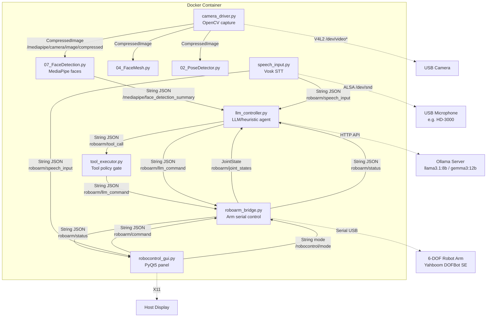

# Yahboom DOFBot Arm — Project Analysis

## Overview

This is a **voice-controlled 6-DOF robot arm** system built on **ROS 2 Jazzy**, running entirely inside Docker. It combines:

- **Hardware control** of a Yahboom DOFBot SE via serial interface
- **Speech recognition** (offline, via Vosk) with wake-word activation
- **LLM-driven command mapping** (via Ollama or HTTP endpoint)
- **Computer vision** (MediaPipe face detection, face mesh, pose)
- **PyQt5 GUI** for manual control and telemetry display

The system supports **German and English** voice commands and defaults to German.

---

## Architecture



---

## ROS 2 Packages

### `arm_mediapipe` — Core Control Package

| Script | Role |
|---|---|
| [roboarm_bridge.py](file:///home/martin/workspace/AG-Projects/Yahboom_DOFBot-Arm/src/arm_mediapipe/scripts/roboarm_bridge.py) | Central arm controller node. Connects to serial hardware, accepts commands from GUI and LLM sources, enforces mode-based arbitration, rate limiting, and safety guards. Publishes joint states and status telemetry. |
| [llm_controller.py](file:///home/martin/workspace/AG-Projects/Yahboom_DOFBot-Arm/src/arm_mediapipe/scripts/llm_controller.py) | LLM agent node. Receives speech transcripts + face detection + joint states, queries Ollama/HTTP/heuristic provider, maps speech to arm actions, supports tool-call schema for agentic control. Handles voice output via espeak-ng. |
| [speech_input.py](file:///home/martin/workspace/AG-Projects/Yahboom_DOFBot-Arm/src/arm_mediapipe/scripts/speech_input.py) | Vosk-based offline speech recognizer. Captures from USB microphone, implements wake-word activation ("martin"/"karli"), persistent voice command mode, and publishes transcripts. |
| [tool_executor.py](file:///home/martin/workspace/AG-Projects/Yahboom_DOFBot-Arm/src/arm_mediapipe/scripts/tool_executor.py) | Policy gate for agentic tool calls. Maps LLM tool-call JSON to bridge actions, enforces allowed-action whitelist and duration limits, publishes responses. |
| [docker_stack.launch.py](file:///home/martin/workspace/AG-Projects/Yahboom_DOFBot-Arm/src/arm_mediapipe/launch/docker_stack.launch.py) | ROS 2 launch file orchestrating all nodes with conditional enablement. |

### `dofbot_mediapipe` — Vision Package

| Script | Role |
|---|---|
| [camera_driver.py](file:///home/martin/workspace/AG-Projects/Yahboom_DOFBot-Arm/src/dofbot_mediapipe/scripts/camera_driver.py) | OpenCV camera node. Publishes JPEG compressed frames to ROS topic. Supports 180° rotation. |
| [07_FaceDetection.py](file:///home/martin/workspace/AG-Projects/Yahboom_DOFBot-Arm/src/dofbot_mediapipe/scripts/07_FaceDetection.py) | MediaPipe face detection. Subscribes to camera, publishes face summary JSON (center, bbox, keypoints, score). |
| [04_FaceMesh.py](file:///home/martin/workspace/AG-Projects/Yahboom_DOFBot-Arm/src/dofbot_mediapipe/scripts/04_FaceMesh.py) | MediaPipe face mesh (optional, disabled by default). |
| [02_PoseDetector.py](file:///home/martin/workspace/AG-Projects/Yahboom_DOFBot-Arm/src/dofbot_mediapipe/scripts/02_PoseDetector.py) | MediaPipe pose detector (optional, disabled by default). |

---

## Key ROS 2 Topics

| Topic | Type | Publisher → Subscriber |
|---|---|---|
| `/mediapipe/camera/image/compressed` | `CompressedImage` | camera_driver → face_detection, GUI |
| `/mediapipe/face_detection_summary` | `String (JSON)` | face_detection → llm_controller, GUI |
| `roboarm/command` | `String (JSON)` | GUI → bridge |
| `roboarm/llm_command` | `String (JSON)` | llm_controller/tool_executor → bridge |
| `roboarm/status` | `String (JSON)` | bridge → GUI, llm_controller |
| `roboarm/joint_states` | `JointState` | bridge → llm_controller |
| `roboarm/speech_input` | `String (JSON)` | speech_input → llm_controller, GUI |
| `roboarm/tool_call` | `String (JSON)` | llm_controller → tool_executor |
| `roboarm/tool_response` | `String (JSON)` | tool_executor → llm_controller |
| `/robocontrol/mode` | `String` | GUI → bridge |

---

## Control Mode Arbitration

The bridge implements 3 control modes, switchable at runtime via the GUI `MODE` button:

| Mode | GUI commands | LLM commands |
|---|---|---|
| **GUI** | ✅ All accepted | ❌ All rejected |
| **LLM** | ⚠️ Emergency only (`power_off`, `home`, `refresh`) | ✅ All accepted |
| **AUTO** | ✅ All accepted | ✅ Accepted, but suppressed for `manual_override_window_s` after manual input |

**Safety guards** (when `DOFBOT_STRICT_SAFETY=1`):
- Rate limiting (default 8 Hz)
- Stale payload rejection (default 2s timeout)
- LLM commands blocked when servo readback fails

---

## Voice Command Pipeline

```
Microphone → Vosk STT → Wake Word Gate → Speech Transcript → LLM Controller
                                                                    ↓
                                              ┌─── Direct keyword mapping (fast path)
                                              │    hoch/up → move_up
                                              │    links/left → move_left
                                              │    nimm/grip → grip_close
                                              │    stop → clear latched motion
                                              └─── LLM query (fallback, if no keyword match)
                                                                    ↓
                                              Tool Call → Tool Executor → Bridge → Servo
```

**Wake word**: Configurable (default "martin" or "karli"). Activates persistent voice command mode — subsequent commands don't need the wake word. Say "stop"/"halt" to exit.

**Continuous motion**: Movement commands (`up`, `down`, `left`, `right`, etc.) are latched and repeated each tick until `stop` is spoken.

---

## Docker Infrastructure

| File | Purpose |
|---|---|
| [Dockerfile](file:///home/martin/workspace/AG-Projects/Yahboom_DOFBot-Arm/docker/Dockerfile) | Multi-stage build: builder stage compiles ROS 2 packages, runner stage installs runtime deps (espeak-ng, Qt libs, PortAudio) and copies built artifacts |
| [docker-compose.yml](file:///home/martin/workspace/AG-Projects/Yahboom_DOFBot-Arm/docker/docker-compose.yml) | Headless stack (no GUI). Maps serial, camera, audio devices. ~50 environment variables. |
| [entrypoint.sh](file:///home/martin/workspace/AG-Projects/Yahboom_DOFBot-Arm/docker/entrypoint.sh) | Two modes: `stack` (just ROS launch) or `gui` (ROS launch in background + Qt GUI in foreground). Waits for `/roboarm/status` topic before starting GUI. |
| [start_robocontrol_container_gui.sh](file:///home/martin/workspace/AG-Projects/Yahboom_DOFBot-Arm/start_robocontrol_container_gui.sh) | Host-side launcher. Auto-detects serial/camera/audio devices, builds image, runs container with X11 forwarding and full environment passthrough. |

**Base image**: `ros:jazzy-ros-base` (Ubuntu 24.04, Python 3.12)

---

## GUI ([robocontrol_gui.py](file:///home/martin/workspace/AG-Projects/Yahboom_DOFBot-Arm/robocontrol_gui.py))

PyQt5 window with:
- **Servo telemetry panels** (angle, raw position, speed, acceleration for all 6 servos)
- **Directional pad** (Up/Down/Left/Right as round buttons)
- **Gripper controls** (Open/Close, Turn Left/Right)
- **Arm stretch/shrink**
- **Action bar**: ON/OFF, HOME, REFRESH, FACE DETECTION toggle, MODE cycle
- **Camera preview** with face detection overlay (bounding boxes + keypoints)
- **Text output panel**: control mode, GUI/LLM activity state, speech status, face tracking info

Communicates with bridge via ROS 2 topics. Spins ROS node at 50 Hz (20ms timer).

---

## LLM Providers

| Provider | Description |
|---|---|
| `ollama` | Local Ollama server. Sends chat completion with system prompt + JSON state. Recommended models: `llama3.1:8b`, `gemma3:12b`, `qwen3.5:9b` |
| `http` | Generic JSON POST endpoint. Optional Bearer token auth. |
| `heuristic` | No LLM call. Simple face-tracking logic: face left → move_left, face right → move_right |

The LLM is asked to produce a **tool-call JSON** with `request_id`, `tool`, `params`, and optional `constraints`. Available tools: `arm_action`, `arm_home`, `arm_power`, `arm_gripper`, `arm_motion`.

---

## Hardware

- **Arm**: Yahboom DOFBot SE 6DOF, 6 serial bus servos
- **Serial**: `/dev/ttyUSB0` or auto-detected via `/dev/serial/by-id/`
- **Camera**: Any V4L2 USB camera (auto-excludes LifeCam/HD-3000 for camera to avoid picking the microphone's built-in camera)
- **Microphone**: USB audio (e.g. Microsoft LifeCam HD-3000's built-in mic)
- **Servos**: 5 servos with 0–180° range, wrist rotate with 0–270° range
- **Home position**: `[90, 130, 0, 0, 90, 30]` degrees

---

## Tech Stack Summary

| Layer | Technology |
|---|---|
| Robot OS | ROS 2 Jazzy |
| Container | Docker (multi-stage build) |
| Python | 3.12 |
| GUI | PyQt5 |
| Vision | MediaPipe, OpenCV |
| Speech | Vosk (offline STT), espeak-ng (TTS) |
| LLM | Ollama (local), HTTP endpoint |
| ML deps | PyTorch 2.x, TensorFlow 2.17+, CUDA 12 |
| Serial | pyserial, vendor Arm_Lib |
| DDS | CycloneDDS / FastRTPS |
